# AWD CLI

**Engineering system for reliable AI coding agents.**

Generate production-ready `agents.md` files from **Agent Primitives** with advanced targeting, validation, and composition. Make your VSCode primitives portable across any AI coding agent.

## The Problem with AI Coding Agents Today

Every developer using AI coding agents (Codex CLI, Gemini CLI, Jules, RooCode) faces the same issues:

- 🤖 **Unreliable interactions** - No engineering system, just raw prompting
- 📄 **Manual agents.md maintenance** - Error-prone, inconsistent, hard to maintain  
- 🔒 **Vendor lock-in** - VSCode primitives only work in VSCode
- 🎯 **Poor targeting** - Same context for all file types (Python, React, tests, etc.)

## See AWD in Action (30 seconds)

**Transform Agent Primitives into production-ready agents.md:**

```bash
# Install AWD CLI
curl -sSL https://raw.githubusercontent.com/danielmeppiel/awd-cli/main/install.sh | sh

# Create Agent Primitives with examples
awd init my-project
cd my-project

# Compile into agents.md with advanced targeting & validation
awd compile
```

**Result**: Production-ready `agents.md` that works reliably across all AI coding agents.

## VSCode Users: Make Your Agent Primitives Portable

**Using `.github/instructions/` or `.github/chatmodes/`?** AWD compiles them for any AI coding agent.

```bash
# Works with your existing VSCode setup
cd your-vscode-project
awd compile  # Finds .github/ primitives, generates universal agents.md

# Or migrate to enhanced .awd/ structure
awd init --migrate-github  # Converts to .awd/ with advanced features
```

**For GitHub colleagues**: Turn your VSCode Agent Primitives into portable agents.md files.

## How AWD Goes Beyond Basic Agents.md

### 1. **Complete Agent Primitives System**
```
.awd/
├── instructions/
│   ├── python.instructions.md      # applyTo: "**/*.py"
│   ├── react.instructions.md       # applyTo: "**/*.{tsx,jsx}"
│   └── testing.instructions.md     # applyTo: "**/*{test,spec}*"
├── chatmodes/
│   ├── backend.chatmode.md         # AI personas for different roles
│   └── frontend.chatmode.md        # Domain-specific expertise
├── context/
│   └── architecture.context.md     # System design context
├── specs/
│   └── oauth-feature.spec.md       # Implementation blueprints
├── memory/
│   └── lessons-learned.memory.md   # Preserved knowledge across sessions
└── workflows/
    └── implement-feature.prompt.md # Agentic Workflows for non-interactive execution
```

### 2. **Advanced Targeting with `applyTo`**
```markdown
---
applyTo: "**/*.py"
---
# Python-specific standards (only shows for Python files)
```

### 3. **Engineering Reliability**
```bash
awd compile --validate  # Validates syntax before generation
awd compile --watch     # Auto-regenerates on changes
awd compile --chatmode backend  # Include specific AI persona
```

### 4. **Agentic Workflows: Complete Non-Interactive Processes**
Execute complete development tasks through structured `.prompt.md` files across **any coding agent CLI**:

```bash
# Same workflow, different runtimes - AWD handles the translation
awd run implement-oauth --param feature=oauth           # Uses Codex runtime
awd run implement-oauth --param feature=oauth --runtime llm  # Uses LLM library
awd run implement-oauth --param feature=oauth --runtime gemini # Uses Gemini CLI (future)
```

**Key Value**: Your `.prompt.md` workflows are **runtime-portable**. Write once, execute on any supported coding agent CLI through AWD's simple runtime API.

```bash
# AWD abstracts away runtime differences
awd runtime setup codex     # OpenAI Codex with GitHub MCP integration
awd runtime setup llm       # Simon Willison's LLM with 100+ models
# Future: awd runtime setup gemini, jules, roocode...

# Same workflow file works across all runtimes
awd run debug-performance --param service=api --runtime codex
awd run debug-performance --param service=api --runtime llm
```

Each Agentic Workflow orchestrates multiple Agent Primitives into systematic processes that work whether executed locally in your IDE or delegated to async Coding Agents - **regardless of which coding agent CLI you prefer**.

## Works with All AI Coding Agents

Your generated `agents.md` works with:
- **Codex CLI** - OpenAI's coding agent
- **Gemini CLI** - Google's coding agent  
- **Jules** - Anthropic's coding agent
- **RooCode** - Open source coding agent
- **Any agent supporting [agents.md standard](https://agents.md)**

## Advanced Features

### Agentic Workflow Execution
AWD supports multiple LLM runtimes for executing your `.prompt.md` Agentic Workflows:

- **⚡ OpenAI Codex CLI** (recommended) - OpenAI's [`codex`](https://github.com/openai/codex) with advanced code understanding and native MCP support
- **🔧 LLM Library** - Simon Willison's [`llm`](https://llm.datasette.io/en/stable/index.html) with 100+ models from GitHub, OpenAI, Anthropic, local Ollama, and more

```bash
# AWD manages runtime installation
awd runtime setup codex        # Install Codex with GitHub Models and GitHub MCP Server
awd runtime setup llm          # Install LLM library  
awd runtime list               # Show installed runtimes

# Execute Agentic Workflows across different runtimes
awd run implement-oauth --param feature=oauth    # Uses default Codex runtime
awd run llm --param feature=oauth               # Uses LLM library
```

### Package Management
```bash
# Initialize like npm
awd init my-project

# Install MCP dependencies  
awd install

# Manage like npm packages
```

**Example awd.yml:**
```yaml
name: my-auth-service
version: 1.0.0
scripts:
  start: "codex implement-feature.prompt.md"
  debug: "RUST_LOG=debug codex implement-feature.prompt.md"
dependencies:
  mcp:
    - ghcr.io/github/github-mcp-server
```

## Why AWD?

**Engineering Infrastructure for AI Coding Agents**

Just as npm revolutionized JavaScript development by creating a package ecosystem, AWD creates the missing engineering infrastructure for reliable AI coding agent interactions.

**The Problem**: AI coding agents support agents.md, but creating and maintaining quality agents.md files is manual, error-prone, and vendor-locked. We have the AI coding agents but lack the engineering system around them.

**The AWD Solution**: Complete engineering toolchain for Agent Primitives and agents.md generation

**Key Benefits**:
- 🏗️ **Engineering Reliability** - Validation, targeting, composition vs manual agents.md maintenance
- ✅ **Portability** - VSCode Agent Primitives work with any AI coding agent supporting agents.md
- ✅ **Advanced Targeting** - `applyTo` patterns for file-specific context vs one-size-fits-all
- ✅ **Complete System** - Instructions + Chat Modes + Agentic Workflows + Specs + Memory + Context
- ✅ **Standards Compliant** - Works with the [agents.md ecosystem](https://agents.md)

## Philosophy: The AWD Manifesto

AWD follows our **[AWD Manifesto](MANIFESTO.md)** - core principles for AI-native development:

- 🌐 **Portability over Vendor Lock-in** - Write once, run anywhere
- 📝 **Natural Language over Code Complexity** - English beats any programming language  
- ♻️ **Reusability over Reinvention** - Share Agent Primitives like code packages
- 🔍 **Reliability over Magic** - Predictable, transparent execution
- 🛠️ **Developer Experience over AI Sophistication** - Simple tools, powerful results

## Architecture

```mermaid
graph TD
    A["📝 Agent Primitives<br/>.instructions.md, .chatmode.md<br/>.prompt.md, .spec.md, etc."] --> B["🔧 AWD CLI"]
    
    B --> D["📦 AWD Package Manager<br/>Dependencies<br/>Templates"]
    B --> C["⚙️ AWD Agents Compiler<br/>agents.md Generation<br/>Validation & Targeting"]
    B --> E["🏗️ AWD Runtime Manager<br/>Install & Configure<br/>Codex, LLM, etc."]
    
    C --> F["📄 agents.md<br/>Production-Ready<br/>AI Coding Agent Context"]
    E --> G["⚡ LLM Runtimes<br/>Codex (Rust)<br/>LLM (Python)"]
    
    F --> H["🤖 AI Coding Agents<br/>Codex CLI, Gemini CLI<br/>Jules, RooCode"]
    G --> I["🛠️ MCP Servers<br/>Tool Integration"]
    
    style A fill:#e3f2fd,stroke:#1976d2,stroke-width:2px,color:#000
    style B fill:#f3e5f5,stroke:#7b1fa2,stroke-width:3px,color:#000
    style C fill:#f3e5f5,stroke:#7b1fa2,stroke-width:2px,color:#000
    style D fill:#f3e5f5,stroke:#7b1fa2,stroke-width:2px,color:#000
    style E fill:#f3e5f5,stroke:#7b1fa2,stroke-width:2px,color:#000
    style F fill:#065f46,stroke:#047857,stroke-width:2.5px,color:#ffffff
    style G fill:#fce4ec,stroke:#c2185b,stroke-width:2px,color:#000
    style H fill:#e8f5e8,stroke:#388e3c,stroke-width:2px,color:#000
    style I fill:#fff3e0,stroke:#ff9800,stroke-width:1px,color:#000
```



**Key Insight**: AWD CLI transforms Agent Primitives into production-ready agents.md files through compilation with advanced targeting and validation. The agents.md output works with any AI coding agent supporting the standard. 

## Installation

### Quick Install (Recommended)
```bash
curl -sSL https://raw.githubusercontent.com/danielmeppiel/awd-cli/main/install.sh | sh
```

### Python Package
```bash
pip install awd-cli
```

### Manual Download
Download the binary for your platform from [GitHub Releases](https://github.com/danielmeppiel/awd-cli/releases/latest):

```bash
# Linux x86_64
curl -L https://github.com/danielmeppiel/awd-cli/releases/latest/download/awd-linux-x86_64.tar.gz | tar -xz && sudo mv awd-linux-x86_64/awd /usr/local/bin/

# macOS Intel
curl -L https://github.com/danielmeppiel/awd-cli/releases/latest/download/awd-darwin-x86_64.tar.gz | tar -xz && sudo mv awd-darwin-x86_64/awd /usr/local/bin/

# macOS Apple Silicon  
curl -L https://github.com/danielmeppiel/awd-cli/releases/latest/download/awd-darwin-arm64.tar.gz | tar -xz && sudo mv awd-darwin-arm64/awd /usr/local/bin/
```

### From Source (Developers)
```bash
git clone https://github.com/danielmeppiel/awd-cli.git
cd awd-cli && pip install -e .
```

## CLI Usage Reference

**Complete CLI Reference**: See [CLI Reference](docs/cli-reference.md) for detailed documentation.

```bash
# Core agents.md compilation
awd compile                                       # Generate agents.md from Agent Primitives
awd compile --validate                           # Validate Agent Primitives syntax
awd compile --watch                              # Auto-regenerate on changes
awd compile --chatmode backend                   # Include specific AI persona

# Project management
awd init my-project                              # Initialize new AWD project with Agent Primitives
awd install                                      # Install MCP dependencies

# Agentic Workflow execution (requires runtime setup)
awd runtime setup codex                          # Install Codex runtime with GitHub MCP integration
awd run implement-feature --param name="oauth"   # Execute .prompt.md Agentic Workflows
awd run debug-issue --param service="api"        # Run diagnostic Agentic Workflows
awd preview implement-feature                    # Preview compiled Agentic Workflow

# Runtime management
awd runtime list                                 # Show installed runtimes
awd runtime status                              # Check active runtime
```

## Community

- 📚 [Documentation](docs/index.md) - Guides and examples
- 🤝 [Contributing](CONTRIBUTING.md) - Help build the ecosystem  
- ⭐ Star this repo if you find it useful!

---

**AWD makes Agent Primitives portable across any AI coding agent supporting agents.md.**
