# Agentic Workflow Definitions (AWD)

**The NPM for AI-Native Development** - Natural language is the new scripting language. Now you can build, package, share, and run agentic prompts and workflows across any LLM runtime. 

**Think npm + Node.js, but for Natural Language.**

## Quick Start (2 minutes)

> [!NOTE] 
> **📋 Prerequisites**: Get a GitHub fine-grained Personal Access Token with **read-only Models permissions** at [github.com/settings/personal-access-tokens/new](https://github.com/settings/personal-access-tokens/new)

```bash
# 1. Install AWD CLI
git clone https://github.com/danielmeppiel/awd-cli.git
cd awd-cli && pip install -e .

# 2. Configure GitHub Models
llm keys set github
# Paste your GitHub PAT when prompted

# 3. Initialize your first AWD project (like npm init)
awd init my-hello-world

# 4. Install AWD and MCP dependencies and run (like npm install && npm start)
cd my-hello-world
awd install
awd run --param name="Developer"

# 5. Preview before execution
awd preview --param name="Developer"
```

**That's it!** You're now running AI prompt applications against an LLM runtime.

## Supported Runtimes

AWD supports multiple AI runtime environments:

- **🔧 LLM Library** (default) - Simon Willison's [`llm`](https://llm.datasette.io/en/stable/index.html) with 100+ models from GitHub, OpenAI, Anthropic, local Ollama, and more
- **⚡ OpenAI Codex CLI** - OpenAI's [`codex`](https://github.com/openai/codex) with advanced code understanding and native MCP support

📖 **Setup Guide**: See [Runtime Integration](docs/runtime-integration.md) for detailed setup instructions for both runtimes.

## How It Works

**Initialize like npm:**

```bash
# Create new AWD project (like npm init)
awd init my-app

# Install MCP dependencies (like npm install)
cd my-app && awd install
```

**Write prompts with MCP integration:**

```markdown
---
description: Analyzes application logs for errors
mcp:
  - ghcr.io/github/github-mcp-server
input: [service_name, time_window]
---

# Analyze Application Logs

Analyze logs for ${input:service_name} over the last ${input:time_window}.

## Instructions

1. Use the **get_me** tool to identify the user
2. Retrieve logs for the specified service and timeframe
3. Identify ERROR and FATAL messages  
4. Look for patterns and provide recommendations
```

**Run anywhere:**

```bash
# Run entrypoint prompt (no name needed)
awd run --param service_name=api --param time_window=1h

# Run specific prompts with different runtimes
awd run analyze-logs --runtime=llm --llm=github/gpt-4o-mini
awd run analyze-logs --runtime=llm --llm=ollama/llama3.2  
awd run analyze-logs --runtime=codex
```

**Manage like npm packages:**

```bash
# Project configuration (awd.yml)
name: my-logging-app
version: 1.0.0
entrypoint: analyze-logs.prompt.md
dependencies:
  mcp:
    - ghcr.io/github/github-mcp-server
    - logs-analyzer-mcp-server
```

# Publish your prompts  
awd publish github.com/myteam/custom-prompts
```

## Beyond Simple Prompts: Composable Workflows

> [!WARNING]
> Workflow composition and prompt chaining are part of the vision but not yet implemented. This is planned for Phase 3. Currently, AWD executes individual prompts only.

**Prompts can reference other prompts** to create powerful agentic workflows:

```markdown
---
name: incident-response
description: Complete incident response procedure
input: [severity, affected_service]
---

# Incident Response

## Step 1: Initial Analysis
Analyze logs using [analyze-logs](./analyze-logs.prompt.md) with ${service_name:${input:affected_service}} and ${time_window:1h}

## Step 2: Determine Response
Based on the log analysis results:
- If severity is **CRITICAL**: escalate immediately and proceed to emergency response
- If severity is **HIGH**: notify team using [alert-team](./alert-team.prompt.md) with ${service:${input:affected_service}} and ${severity:${input:severity}}
- Otherwise: create standard incident ticket

## Step 3: Emergency Response (Critical Only)
**Ask for approval**: "Critical incident detected for ${input:affected_service}. Execute emergency procedures? (yes/no)"

If approved:
- Scale service using [scale-service](./scale-service.prompt.md) with ${service:${input:affected_service}} and ${action:scale-up}
```

Run it as any other prompt:
```bash

# Run complex agentic workflows  
awd run incident-response --severity=HIGH --affected_service=api-gateway

# Preview without execution
awd preview incident-response --severity=HIGH --affected_service=api-gateway
```

## Philosophy: The AWD Manifesto

AWD follows our **[AWD Manifesto](MANIFESTO.md)** - core principles for AI-native development:

- 🌐 **Portability over Vendor Lock-in** - Write once, run anywhere
- 📝 **Natural Language over Code Complexity** - English beats any programming language  
- ♻️ **Reusability over Reinvention** - Share prompts like code packages
- 🔍 **Reliability over Magic** - Predictable, transparent execution
- 🛠️ **Developer Experience over AI Sophistication** - Simple tools, powerful results

## Why AWD?

**Think NPM + Node.js, but for AI-Native Development**

Just as npm revolutionized JavaScript development by creating a package ecosystem, AWD creates the missing infrastructure for AI-native applications written in Markdown.

**The Problem**: We have the new programming language (natural language in markdown) but lack the essential tooling infrastructure. Every team reinvents their prompts, cannot share them, cannot distribute them, can't run them at scale. It's like having JavaScript syntax but no npm, Node.js, or package ecosystem.

**The AWD Solution**: Complete the tooling stack for AI-native development

| Traditional Web Dev | AI-Native Development | Role |
|---------------------|----------------------|------|
| **npm** | **AWD-CLI** | Package manager, dependency resolution, distribution |
| **Node.js** | **[llm](https://github.com/simonw/llm)/[codex](https://github.com/openai/codex)** | Runtime environment, execution engine |
| **JavaScript** | **Natural Language Prompts** | Programming language |
| **V8 Engine** | **LLM Models** | Core computation engine |

**Key Benefits**:
- 🏗️ **Infrastructure Layer** - AWD is the package manager, runtimes ([llm](https://github.com/simonw/llm), [codex](https://github.com/openai/codex)) are the execution engines
- ✅ **Portable** - Same prompt runs on any LLM runtime (just like npm packages run on any Node.js version)
- ✅ **Reusable** - Share prompts like code packages with versioning and dependencies
- ✅ **Composable** - Prompts can reference other prompts to create complex workflows
- ✅ **Tool-enabled** - Integrate with APIs via MCP servers, handled by your chosen runtime

Just as npm enabled JavaScript's explosive growth, AWD enables the prompt-based application ecosystem to flourish.

## Architecture

```mermaid
graph TD
    A["📝 Prompts<br/>.prompt.md<br/>Natural Language Programs"] --> B["🔧 AWD<br/>Package Manager Layer"]
    B --> D["⚡ LLM Runtime<br/>llm library<br/>OpenAI Codex<br/>Future runtimes"]
    B --> E["📦 Registries<br/>AWD packages<br/>MCP servers"]
    
    D -.-> F["🛠️ MCP Servers<br/>Tool Integration<br/>Managed by Runtime"]
    D -.-> G["🧠 LLM Models<br/>Cloud: Anthropic, Azure, GitHub<br/>Local: Ollama"]
    
    style A fill:#e3f2fd,stroke:#1976d2,stroke-width:2px,color:#000
    style B fill:#f3e5f5,stroke:#7b1fa2,stroke-width:3px,color:#000
    style D fill:#fff8e1,stroke:#f57c00,stroke-width:2px,color:#000
    style E fill:#fce4ec,stroke:#c2185b,stroke-width:2px,color:#000
    style F fill:#e8f5e8,stroke:#388e3c,stroke-width:1px,color:#000
    style G fill:#fff3e0,stroke:#ff9800,stroke-width:1px,color:#000
```




**Key Insight**: AWD handles packaging and distribution (like npm), while runtimes handle execution and tool integration (like Node.js). This separation enables innovation at each layer without tight coupling. share, and run agentic prompts and workflows across any LLM runtime. 

## CLI Usage Reference

```bash
# Project Management (like npm)
awd init [project-name]                      # Initialize new AWD project (like npm init)
awd install                                  # Install MCP dependencies from awd.yml (like npm install)
awd list                                     # List all available prompts in project

# Execution  
awd run                                      # Run entrypoint prompt
awd run prompt-name --param key=value       # Run specific prompt with parameters
awd preview --param key=value               # Preview entrypoint without execution
awd preview prompt-name --param key=value   # Preview specific prompt without execution

# Runtime Selection
awd run --runtime=llm --llm=github/gpt-4o-mini    # Run with GitHub Models (free)
awd run --runtime=llm --llm=ollama/llama3.2       # Run with local Ollama
awd run --runtime=codex                           # Run with OpenAI Codex

# Configuration
awd config --show                            # Show current configuration
awd models                                   # List available LLM models
```

**Complete CLI Reference**: See [CLI Reference](docs/cli-reference.md) for detailed documentation.

## Community

- 📚 [Documentation](docs/) - Guides and examples
- 🤝 [Contributing](CONTRIBUTING.md) - Help build the ecosystem  
- ⭐ Star this repo if you find it useful!

---

**AWD makes AI prompts as shareable and reusable as code packages.**


## Development

```zsh
# Install with dev dependencies
uv pip install -e ".[dev]"

# Run tests, lint and format
pytest
flake8 awd-cli tests
black awd-cli tests
```

## Stack
- Python 3.13+
- `click` for CLI
- `llm` for LLM runtime abstraction
- `mcp` package with `FastMCP` for MCP server functionality
- `pytest`, `flake8`, `black` for development
- GitHub Actions for CI/CD
