# Agentic Workflow Definitions (AWD)

**Make any project compatible with AI-Native Development** - Stop the trial-and-error cycle of inconsistent AI results. AWD implements the proven [AI-Native Development framework](https://danielmeppiel.github.io/awesome-ai-native/) that delivers reliable, repeatable workflows with any coding agent.

**Works with Any Coding Agent** - From GitHub Copilot to Cursor, Codex to Aider. AWD creates portable Agent Primitives that ensure consistent AI behavior across all tools through the emerging [agents.md standard](https://agents.md).

**Think npm + Node.js, but for AI-Native Development.**

| Traditional Web Dev | AI-Native Development | Role |
|---------------------|----------------------|------|
| **npm** | **AWD Package Manager** | Dependency resolution, distribution |
| **TypeScript Compiler** | **AWD Primitives Compiler** | Transform Agent Primitives → agents.md format |
| **Node.js** | **Coding Agent Runtimes** | Execute compiled AI workflows |
| **JavaScript** | **Natural Language** | What runtimes actually understand |

## Quick Start (2 minutes)

> [!NOTE] 
> **📋 Prerequisites**: Get a GitHub fine-grained Personal Access Token with **read-only Models permissions** at [github.com/settings/personal-access-tokens/new](https://github.com/settings/personal-access-tokens/new)

```bash
# 1. Install AWD CLI (zero dependencies)
curl -sSL https://raw.githubusercontent.com/danielmeppiel/awd-cli/main/install.sh | sh

# 2. Set up your GitHub PAT and an Agent CLI
export GITHUB_TOKEN=your_token_here
awd runtime setup codex # Installs OpenAI Codex CLI

# 3. Transform your project with AI-Native structure
awd init my-ai-native-project

# 4. Compile Agent Primitives for any coding agent
cd my-ai-native-project
awd compile  # Generates agents.md compatible with multiple Agent CLIs

# 5. Install MCP dependencies and execute agentic workflows (*.prompt.md files)
awd install
awd run start --param name="Developer"
```

**That's it!** Your project now has reliable AI-Native Development workflows that work with any coding agent.

## What You Just Built

You just created an AI-native project with:

- **Agent Primitives** - Configurable tools that deploy proven prompt + context engineering techniques
- **Universal Compatibility** - Works with GitHub Copilot, Cursor, Codex, Aider, and any agent supporting agents.md
- **Reliable Workflows** - Replace one-off prompting with reusable, structured AI workflows
- **Team Knowledge** - Capture and share AI patterns across your entire development team

## Why This Matters

Most developers experience AI as inconsistent and unreliable:
- ❌ **Ad-hoc prompting** that produces different results each time
- ❌ **Context overload** that confuses AI agents and wastes tokens  
- ❌ **Vendor lock-in** to specific AI tools and platforms
- ❌ **No knowledge persistence** across sessions and team members

**AWD solves this** by implementing the complete [3-layer AI-Native Development framework](https://danielmeppiel.github.io/awesome-ai-native/docs/concepts/):

**🔧 Layer 1: Markdown Prompt Engineering** - Structured, repeatable AI instructions  
**⚙️ Layer 2: Agent Primitives** - Configurable tools that deploy prompt + context engineering  
**🎯 Layer 3: Context Engineering** - Strategic LLM memory management for reliability

**Result**: Transform from supervising every AI interaction to architecting systems that delegate complete workflows to AI agents.

## AI-Native Development Maturity Journey

**From Manual Supervision → Engineered Architecture**

Most developers start by manually supervising every AI interaction. AWD enables the transformation to AI-Native engineering:

### 🔴 Before AWD: Manual Agent Supervision
- Write one-off prompts for each task  
- Manually guide every AI conversation
- Start from scratch each time
- *You're the bottleneck - every AI task needs your attention*

### 🟢 With AWD: Engineered Agent Delegation  
- Build reusable Agent Primitives once
- Engineer context strategically 
- Delegate complete workflows to AI
- *You're the architect - AI handles execution autonomously*

> **Learn the Complete Framework**: Explore the [AI-Native Development Guide](https://danielmeppiel.github.io/awesome-ai-native/) for approaches to Markdown Prompt Engineering, Agent Primitives, and Context Engineering.

## How Agent Primitives Work

AWD implements Agent Primitives - the configurable tools that deploy prompt engineering and context engineering techniques:

**🏗️ Initialize a project with AI-Native structure:**

```bash
awd init my-project  # Creates complete Agent Primitives scaffolding + awd.yml
```

**⚙️ Generated Project Structure:**

```yaml
my-project/
├── awd.yml              # Project configuration and script definitions
└── .awd/
    ├── chatmodes/       # Role-based AI expertise with tool boundaries
    │   ├── backend-dev.chatmode.md     # API development specialist
    │   └── frontend-dev.chatmode.md    # UI development specialist
    ├── instructions/    # Targeted guidance by file type and domain  
    │   ├── security.instructions.md    # applyTo: "auth/**"
    │   └── testing.instructions.md     # applyTo: "**/*test*"
    ├── prompts/         # Reusable agentic workflows
    │   ├── code-review.prompt.md       # Systematic review process
    │   └── feature-spec.prompt.md      # Spec-first development
    ├── context/         # Optimized information retrieval
    │   └── architecture.context.md     # Project patterns and decisions
    └── specs/           # Implementation-ready blueprints
        └── api-endpoint.spec.md         # Deterministic outcomes
```

**🔄 Compile for Universal Agent CLI Compatibility:**

```bash
awd compile  # Transforms .awd/ primitives → agents.md standard
```

This generates an `AGENTS.md` file compatible with all major coding agents.

## Example: Structured AI Workflows

**Traditional Prompt** (inconsistent, manual):
```
"Add authentication to the API"
```

**Agent Primitives Workflow** (reliable, reusable):

```markdown
---
description: Implement secure authentication system
mode: backend-dev
mcp:
  - ghcr.io/github/github-mcp-server
input: [auth_method, session_duration]
---

# Secure Authentication Implementation

## Context Loading
Review [security standards](../context/security-standards.md) and [existing auth patterns](../context/auth-patterns.md).

## Implementation Requirements
- Use ${input:auth_method} authentication 
- Session duration: ${input:session_duration}
- Follow [security checklist](../specs/auth-security.spec.md)

## Validation Gates
🚨 **STOP**: Confirm security review before implementation
```

**Execute with any coding agent:**
```bash
awd run implement-auth --param auth_method=jwt --param session_duration=24h
```

## Supported AI Runtimes

AWD manages AI runtime installation and provides MCP tool integration:

- **⚡ OpenAI Codex CLI** (recommended) - Advanced code understanding with GitHub Models integration
- **🔧 LLM Library** - 100+ models from OpenAI, Anthropic, GitHub, local Ollama

```bash
# AWD manages runtime installation
awd runtime setup codex        # Install Codex with GitHub Models  
awd runtime setup llm          # Install LLM library
awd runtime list               # Show installed runtimes
```

## Packaging & Distribution

**Manage like npm packages:**

```yaml
# awd.yml - Project configuration
name: my-ai-native-app
version: 1.0.0
scripts:
  start: "RUST_LOG=debug codex implement-feature.prompt.md"
  review: "codex code-review.prompt.md" 
  docs: "llm generate-docs.prompt.md -m github/gpt-4o-mini"
dependencies:
  mcp:
    - ghcr.io/github/github-mcp-server
```

**Share and reuse across projects:**
```bash
awd install                    # Install MCP dependencies
awd run start --param feature="user-auth"
awd run review --param files="src/auth/"
```

## Why AWD? The Missing Infrastructure for AI-Native Development

**The Problem**: Developers have powerful AI coding assistants but lack systematic approaches to make them reliable and scalable. Every team reinvents their AI workflows, can't share effective patterns, and struggles with inconsistent results.

**The Solution**: AWD provides the missing infrastructure layer that makes AI-Native Development portable and reliable.

### Key Benefits

**🎯 Reliable Results** - Replace trial-and-error with proven AI-Native Development patterns  
**🔄 Universal Portability** - Works with any coding agent through the agents.md standard  
**📦 Knowledge Packaging** - Share AI workflows like code packages with versioning  
**🧠 Compound Intelligence** - Primitives improve through iterative team refinement  
**⚡ Team Scaling** - Transform any project for reliable AI-Native Development workflows

### The Infrastructure Analogy

Just as npm revolutionized JavaScript by creating package ecosystem infrastructure, AWD creates the missing infrastructure for AI-Native Development:

- **Package Management**: Share and version AI workflows like code dependencies
- **Compilation**: Transform Agent Primitives into runtime-compatible formats  
- **Runtime Management**: Install and configure AI tools automatically
- **Standards Compliance**: Generate agents.md files for universal compatibility

## The Complete AI-Native Framework

AWD implements the complete [AI-Native Development framework](https://danielmeppiel.github.io/awesome-ai-native/docs/concepts/) through engineering practices:

```mermaid
graph TD
    A["📝 Agent Primitives<br/>.awd/ directory<br/>(.chatmode, .instructions, .prompt, .context, .spec)"] --> B["🔧 AWD CLI"]
    
    B --> D["📦 AWD Package Manager<br/>Dependencies<br/>Templates"]
    B --> C["⚙️ AWD Primitives Compiler<br/>Script Resolution<br/>Primitive Compilation"]
    B --> E["🏗️ AWD Runtime Manager<br/>Install & Configure<br/>Codex, LLM, etc."]
    
    C --> F["📄 AGENTS.md<br/>Portable Standard<br/>Cross-Runtime Compatible"]
    
    F --> G["⚡ AI Coding Agents<br/>GitHub Copilot, Cursor<br/>Codex, Aider, etc."]
    
    E --> H["🛠️ MCP Servers<br/>Tool Integration"]
    E --> I["🧠 LLM Models<br/>GitHub Models<br/>Ollama, etc."]
    
    style A fill:#e3f2fd,stroke:#1976d2,stroke-width:2px,color:#000
    style B fill:#f3e5f5,stroke:#7b1fa2,stroke-width:3px,color:#000
    style C fill:#f3e5f5,stroke:#7b1fa2,stroke-width:2px,color:#000
    style D fill:#f3e5f5,stroke:#7b1fa2,stroke-width:2px,color:#000
    style E fill:#f3e5f5,stroke:#7b1fa2,stroke-width:2px,color:#000
    style F fill:#fff3e0,stroke:#ff9800,stroke-width:2px,color:#000
    style G fill:#fce4ec,stroke:#c2185b,stroke-width:2px,color:#000
    style H fill:#e8f5e8,stroke:#388e3c,stroke-width:1px,color:#000
    style I fill:#fff3e0,stroke:#ff9800,stroke-width:1px,color:#000
```



**Key Architecture**: AWD CLI provides three core components: Package Manager (dependencies), Primitives Compiler (transforms .awd/ → agents.md), and Runtime Manager (install/configure AI tools). The compiled agents.md ensures your Agent Primitives work with any coding agent.

**Learn the Complete Framework**: [AI-Native Development Guide →](https://danielmeppiel.github.io/awesome-ai-native/) 

## Installation

### Quick Install (Recommended)
```bash
curl -sSL https://raw.githubusercontent.com/danielmeppiel/awd-cli/main/install.sh | sh
```

### Python Package
```bash
pip install awd-cli
```

### Manual Download
Download the binary for your platform from [GitHub Releases](https://github.com/danielmeppiel/awd-cli/releases/latest):

```bash
# Linux x86_64
curl -L https://github.com/danielmeppiel/awd-cli/releases/latest/download/awd-linux-x86_64.tar.gz | tar -xz && sudo mv awd-linux-x86_64/awd /usr/local/bin/

# macOS Intel
curl -L https://github.com/danielmeppiel/awd-cli/releases/latest/download/awd-darwin-x86_64.tar.gz | tar -xz && sudo mv awd-darwin-x86_64/awd /usr/local/bin/

# macOS Apple Silicon  
curl -L https://github.com/danielmeppiel/awd-cli/releases/latest/download/awd-darwin-arm64.tar.gz | tar -xz && sudo mv awd-darwin-arm64/awd /usr/local/bin/
```

### From Source (Developers)
```bash
git clone https://github.com/danielmeppiel/awd-cli.git
cd awd-cli && uv pip install -e .
```

## CLI Reference

**Complete Documentation**: See [CLI Reference](docs/cli-reference.md) for detailed command documentation.

```bash
# Project initialization and setup
awd init my-project                               # Initialize AI-native project structure
awd runtime setup codex                           # Install Codex with GitHub Models
awd install                                       # Install MCP dependencies

# Agent Primitives compilation (run before AI workflows)
awd compile                                       # Generate agents.md from .awd/ primitives  
awd compile --watch                              # Auto-regenerate on changes
awd compile --output custom.md                   # Custom output file

# Workflow execution  
awd run start --param key=value                   # Execute workflows with parameters
awd run review --param files="src/**"            # Run code review workflow
awd preview start --param key=value              # Preview compiled workflow

# Runtime and debugging
awd runtime list                                 # Show installed AI runtimes
awd list                                         # Show available project scripts
RUST_LOG=debug awd run start                     # Enable debug logging
```

## Beyond Simple Prompts: Advanced Workflows

> [!TIP]
> **Workflow Composition**: While complex prompt chaining is planned for future releases, current Agent Primitives already enable reliable AI workflows through structured context engineering and modular primitives.

**Example: Multi-step Feature Development**
```bash
# 1. Generate specification from requirements
awd run create-spec --param feature="user-auth"

# 2. Review and validate specification  
awd run review-spec --param spec="specs/user-auth.spec.md"

# 3. Implement feature following specification
awd run implement --param spec="specs/user-auth.spec.md"

# 4. Generate tests and documentation
awd run test-feature --param feature="user-authentication"
```

Each step leverages your project's Agent Primitives for consistent, reliable results.

## Community & Resources

- 📚 **[AI-Native Development Guide](https://danielmeppiel.github.io/awesome-ai-native/)** - Complete framework documentation
- 📖 **[Documentation](docs/index.md)** - AWD CLI guides and examples
- 🤝 **[Contributing](CONTRIBUTING.md)** - Help build the AI-native ecosystem  
- ⭐ **Star this repo** if AWD helps transform your AI development workflow!

---

**AWD transforms any project into reliable AI-Native Development.**
