# Agentic Workflow Definitions (AWD)

**The NPM for AI-Native Development** - Natural language is the new scripting language. Now you can package, share, and run agentic prompts and workflows across any LLM runtime. 

**Think npm + Node.js, but for Natural Language.**

## Quick Start (2 minutes)

> **📋 Prerequisites**: Get a GitHub fine-grained Personal Access Token with **read-only Models permissions** at [github.com/settings/personal-access-tokens/new](https://github.com/settings/personal-access-tokens/new)

```bash
# 1. Install AWD CLI
pip install awd-cli

# 2. Configure GitHub Models
llm keys set github
# Paste your GitHub PAT when prompted

# 3. Create your first prompt
awd create prompt hello-world

# 4. Run it with GitHub Models
awd run hello-world --runtime=github/gpt-4o-mini

# 5. Or preview without execution
awd preview hello-world
```

**That's it!** You're now running AI prompts across any LLM runtime.

> 💡 **Any LLM Runtime**: AWD is built on the [LLM library](https://llm.datasette.io/en/stable/index.html), so you can use any supported runtime - from local models with Ollama to cloud providers like OpenAI, Anthropic, and more.

## How It Works

**Write prompts in markdown:**

```markdown
---
description: Analyzes application logs for errors  
input: [service_name, time_window]
mcp: [logs-analyzer]  # Optional: tools for advanced prompts
---

# Analyze Application Logs

Analyze logs for ${input:service_name} over the last ${input:time_window}.

1. Retrieve logs for the specified service and timeframe
2. Identify ERROR and FATAL messages  
3. Look for patterns and provide recommendations
```

**Run anywhere:**

```bash
# Same prompt, different runtimes
awd run analyze-logs --runtime=github/gpt-4o-mini --service=api --time=1h
awd run analyze-logs --runtime=ollama/llama3.2 --service=api --time=1h
awd run analyze-logs --runtime=claude-3.5-sonnet --service=api --time=1h
```

**Share like npm packages:**

```bash
# Install from GitHub
awd install github.com/kubernetes/troubleshooting-prompts
awd install github.com/security/vulnerability-scanners

# Publish your prompts  
awd publish github.com/myteam/custom-prompts
```

## Beyond Prompts: Agentic Workflows

**Advanced users can create agentic workflows** that chain multiple prompts together:

**Advanced users can create agentic workflows** that chain multiple prompts together:

```markdown
---
name: incident-response
description: Complete incident response procedure
input: [severity, affected_service]
---

# Incident Response Workflow

## Step 1: Initial Analysis
- [Analyze system logs](./prompts/analyze-logs.prompt.md) for ${input:affected_service}
- Wait for analysis completion before proceeding

## Step 2: Determine Response
Based on the log analysis results:
- If severity is **CRITICAL**: escalate immediately
- If severity is **HIGH**: notify on-call team
- Otherwise: create standard incident ticket
```

Run prompts and agentic workflows anywhere:
```bash
# Run any prompt or agentic workflow directly
awd run analyze-logs --service=api-gateway --time=1h
awd run incident-response --severity=HIGH --affected_service=api-gateway

# Or preview processed content without execution
awd preview analyze-logs --service=api-gateway --time=1h
awd preview incident-response --severity=HIGH --affected_service=api-gateway
```

## Philosophy: The AWD Manifesto

AWD follows our **[AWD Manifesto](MANIFESTO.md)** - core principles for AI-native development:

- 🌐 **Portability over Vendor Lock-in** - Write once, run anywhere
- 📝 **Natural Language over Code Complexity** - English beats any programming language  
- ♻️ **Reusability over Reinvention** - Share prompts like code packages
- 🔍 **Reliability over Magic** - Predictable, transparent execution
- 🛠️ **Developer Experience over AI Sophistication** - Simple tools, powerful results

## Why AWD?

**The Problem**: Every team reinvents AI automation. Prompts are trapped in specific tools.

**AWD Solution**: 
- ✅ **Portable** - Same prompt runs on any LLM
- ✅ **Reusable** - Share prompts like code packages  
- ✅ **Composable** - Agentic workflows reference other prompts
- ✅ **Tool-enabled** - Integrate with APIs via MCP servers

## Architecture

```mermaid
graph TD
    A[📝 Prompts<br/>.prompt.md] --> B[🔧 AWD CLI]
    C[🔄 Agentic Workflows<br/>.workflow.md] --> B
    B --> D[⚡ LLM Runtime<br/>any provider]
    B --> E[📦 AWD + MCP Registries]
    
    style A fill:#e1f5fe,stroke:#0277bd,stroke-width:2px,color:#000
    style B fill:#f3e5f5,stroke:#7b1fa2,stroke-width:3px,color:#000
    style C fill:#e8f5e8,stroke:#388e3c,stroke-width:2px,color:#000
    style D fill:#fff3e0,stroke:#f57c00,stroke-width:2px,color:#000
    style E fill:#fce4ec,stroke:#c2185b,stroke-width:2px,color:#000
```



## Installation & Usage

```bash
awd mcp init
```

### CLI Usage Reference

```bash
# Universal Commands (auto-detects prompts vs workflows)
awd list                                              # List all available prompts and workflows
awd create prompt analyze-logs                        # Create new prompt
awd create workflow incident-response                 # Create new workflow
awd run analyze-logs --param service_name=api         # Run any prompt or workflow
awd preview analyze-logs --param service_name=api     # Preview any prompt or workflow without execution

# Runtime Selection (works with both prompts and workflows)
awd run analyze-logs --runtime=github/gpt-4o-mini     # Run on GitHub Models
awd run deploy-service --runtime=ollama/llama3.2      # Run on local Ollama

# MCP Server Management
awd mcp list                                          # List all installed MCP servers
awd mcp install                                       # Install servers from awd.yml
awd mcp install redis-mcp-server                      # Install server by name
awd mcp verify                                        # Verify servers in awd.yml are installed
awd mcp init                                          # Create awd.yml from installed client servers

# Project Management
awd mcp-sync                                          # Update awd.yml with dependencies from all prompts/workflows

# Execution  
awd run prompt-name --param key=value        # Run with parameters
awd preview prompt-name --param key=value    # Preview without execution

# Creation
awd create prompt my-prompt                   # Create new prompt
awd create workflow my-workflow               # Create new agentic workflow
```

## Community

- 📚 [Documentation](docs/) - Guides and examples
- 🤝 [Contributing](CONTRIBUTING.md) - Help build the ecosystem  
- ⭐ Star this repo if you find it useful!

---

**AWD makes AI prompts as shareable and reusable as code packages.**


## Development

```zsh
# Install with dev dependencies
uv pip install -e ".[dev]"

# Run tests, lint and format
pytest
flake8 awd-cli tests
black awd-cli tests
```

## Stack
- Python 3.13+
- `click` for CLI
- `llm` for LLM runtime abstraction
- `mcp` package with `FastMCP` for MCP server functionality
- `pytest`, `flake8`, `black` for development
- GitHub Actions for CI/CD
