# Agentic Workflow Definitions (AWD)

**The NPM for AI-Native Development** - Natural language is the new scripting language. Now you can build, package, share, and run agentic prompts and workflows across any LLM runtime. 

**Think npm + Node.js, but for Natural Language.**

## Quick Start (2 minutes)

> **📋 Prerequisites**: Get a GitHub fine-grained Personal Access Token with **read-only Models permissions** at [github.com/settings/personal-access-tokens/new](https://github.com/settings/personal-access-tokens/new)

```bash
# 1. Install AWD CLI
pip install awd-cli

# 2. Configure GitHub Models
llm keys set github
# Paste your GitHub PAT when prompted

# 3. Create your first prompt
awd create prompt hello-world

# 4. Run it with GitHub Models
awd run hello-world --runtime=github/gpt-4o-mini

# 5. Or preview without execution
awd preview hello-world
```

**That's it!** You're now running AI prompts across any LLM runtime.

💡 AWD is built on the [LLM library](https://llm.datasette.io/en/stable/index.html), so you can use any supported runtime - from local models with Ollama to cloud providers like OpenAI, Anthropic, and more.

## How It Works

**Write prompts in markdown:**

```markdown
---
description: Analyzes application logs for errors  
input: [service_name, time_window]
mcp: [logs-analyzer]  # Optional: tools for advanced prompts
---

# Analyze Application Logs

Analyze logs for ${input:service_name} over the last ${input:time_window}.

1. Retrieve logs for the specified service and timeframe
2. Identify ERROR and FATAL messages  
3. Look for patterns and provide recommendations
```

**Run anywhere:**

```bash
# Same prompt, different runtimes
awd run analyze-logs --runtime=github/gpt-4o-mini --service=api --time=1h
awd run analyze-logs --runtime=ollama/llama3.2 --service=api --time=1h
awd run analyze-logs --runtime=claude-3.5-sonnet --service=api --time=1h
```

**Share like npm packages:**

```bash
# Install from GitHub
awd install github.com/kubernetes/troubleshooting-prompts
awd install github.com/security/vulnerability-scanners

# Publish your prompts  
awd publish github.com/myteam/custom-prompts
```

## Beyond Simple Prompts: Composable Workflows

**Prompts can reference other prompts** to create powerful agentic workflows:

```markdown
---
name: incident-response
description: Complete incident response procedure
input: [severity, affected_service]
---

# Incident Response

## Step 1: Initial Analysis
Analyze logs using [analyze-logs](./analyze-logs.prompt.md) with ${service_name:${input:affected_service}} and ${time_window:1h}

## Step 2: Determine Response
Based on the log analysis results:
- If severity is **CRITICAL**: escalate immediately and proceed to emergency response
- If severity is **HIGH**: notify team using [alert-team](./alert-team.prompt.md) with ${service:${input:affected_service}} and ${severity:${input:severity}}
- Otherwise: create standard incident ticket

## Step 3: Emergency Response (Critical Only)
**Ask for approval**: "Critical incident detected for ${input:affected_service}. Execute emergency procedures? (yes/no)"

If approved:
- Scale service using [scale-service](./scale-service.prompt.md) with ${service:${input:affected_service}} and ${action:scale-up}
```

Run it as any other prompt:
```bash

# Run complex agentic workflows  
awd run incident-response --severity=HIGH --affected_service=api-gateway

# Preview without execution
awd preview incident-response --severity=HIGH --affected_service=api-gateway
```

## Philosophy: The AWD Manifesto

AWD follows our **[AWD Manifesto](MANIFESTO.md)** - core principles for AI-native development:

- 🌐 **Portability over Vendor Lock-in** - Write once, run anywhere
- 📝 **Natural Language over Code Complexity** - English beats any programming language  
- ♻️ **Reusability over Reinvention** - Share prompts like code packages
- 🔍 **Reliability over Magic** - Predictable, transparent execution
- 🛠️ **Developer Experience over AI Sophistication** - Simple tools, powerful results

## Why AWD?

**Think NPM + Node.js, but for AI-Native Development**

Just as npm revolutionized JavaScript development by creating a package ecosystem, AWD creates the missing infrastructure for AI-native applications written in Markdown.

**The Problem**: We have the new programming language (natural language in markdown) but lack the essential tooling infrastructure. Every team reinvents their prompts, cannot share them, cannot distribute them, can't run them at scale. It's like having JavaScript syntax but no npm, Node.js, or package ecosystem.

**The AWD Solution**: Complete the tooling stack for AI-native development

| Traditional Web Dev | AI-Native Development | Role |
|---------------------|----------------------|------|
| **npm** | **AWD-CLI** | Package manager, dependency resolution, distribution |
| **Node.js** | **[llm](https://github.com/simonw/llm)/[codex](https://github.com/openai/codex)** | Runtime environment, execution engine |
| **JavaScript** | **Natural Language Prompts** | Programming language |
| **V8 Engine** | **LLM Models** | Core computation engine |

**Key Benefits**:
- 🏗️ **Infrastructure Layer** - AWD is the package manager, runtimes ([llm](https://github.com/simonw/llm), [codex](https://github.com/openai/codex)) are the execution engines
- ✅ **Portable** - Same prompt runs on any LLM runtime (just like npm packages run on any Node.js version)
- ✅ **Reusable** - Share prompts like code packages with versioning and dependencies
- ✅ **Composable** - Prompts can reference other prompts to create complex workflows
- ✅ **Tool-enabled** - Integrate with APIs via MCP servers, handled by your chosen runtime

Just as npm enabled JavaScript's explosive growth, AWD enables the prompt-based application ecosystem to flourish.

## Architecture

**Separation of Concerns: Package Management vs Runtime Execution**

```mermaid
graph TD
    A["📝 Prompts<br/>.prompt.md<br/><small>Natural Language Programs</small>"] --> B["🔧 AWD CLI<br/><small>Package Manager Layer</small>"]
    A --> A2["🔗 Other Prompts<br/>via markdown links<br/><small>Dependency Resolution</small>"]
    B --> D["⚡ LLM Runtime<br/><small>Execution Engines</small><br/>• llm library<br/>• OpenAI Codex<br/>• Future runtimes"]
    B --> E["📦 Registries<br/><small>Distribution Layer</small><br/>• AWD packages<br/>• MCP servers"]
    
    D -.-> F["🛠️ MCP Servers<br/><small>Tool Integration</small><br/>Managed by Runtime"]
    
    style A fill:#e3f2fd,stroke:#1976d2,stroke-width:2px,color:#000
    style A2 fill:#e3f2fd,stroke:#1976d2,stroke-width:2px,color:#000
    style B fill:#f3e5f5,stroke:#7b1fa2,stroke-width:3px,color:#000
    style D fill:#fff8e1,stroke:#f57c00,stroke-width:2px,color:#000
    style E fill:#fce4ec,stroke:#c2185b,stroke-width:2px,color:#000
    style F fill:#e8f5e8,stroke:#388e3c,stroke-width:1px,color:#000
```



**Key Insight**: AWD handles packaging and distribution (like npm), while runtimes handle execution and tool integration (like Node.js). This separation enables innovation at each layer without tight coupling. share, and run agentic prompts and workflows across any LLM runtime. 

## CLI Usage Reference

```bash
# Universal Commands
awd list                                              # List all available prompts
awd create prompt analyze-logs                        # Create new prompt
awd run analyze-logs --param service_name=api         # Run any prompt (simple or complex)
awd preview analyze-logs --param service_name=api     # Preview without execution

# Runtime Selection
awd run analyze-logs --runtime=github/gpt-4o-mini     # Run on GitHub Models
awd run deploy-service --runtime=ollama/llama3.2      # Run on local Ollama

# MCP Server Management
awd mcp list                                          # List all installed MCP servers
awd mcp install                                       # Install servers from awd.yml
awd mcp install redis-mcp-server                      # Install server by name
awd mcp verify                                        # Verify servers in awd.yml are installed
awd mcp init                                          # Create awd.yml from installed client servers

# Project Management
awd mcp-sync                                          # Update awd.yml with dependencies from all prompts/workflows

# Execution  
awd run prompt-name --param key=value        # Run with parameters
awd preview prompt-name --param key=value    # Preview without execution

# Creation
awd create prompt my-prompt                           # Create new prompt
```

## Community

- 📚 [Documentation](docs/) - Guides and examples
- 🤝 [Contributing](CONTRIBUTING.md) - Help build the ecosystem  
- ⭐ Star this repo if you find it useful!

---

**AWD makes AI prompts as shareable and reusable as code packages.**


## Development

```zsh
# Install with dev dependencies
uv pip install -e ".[dev]"

# Run tests, lint and format
pytest
flake8 awd-cli tests
black awd-cli tests
```

## Stack
- Python 3.13+
- `click` for CLI
- `llm` for LLM runtime abstraction
- `mcp` package with `FastMCP` for MCP server functionality
- `pytest`, `flake8`, `black` for development
- GitHub Actions for CI/CD
